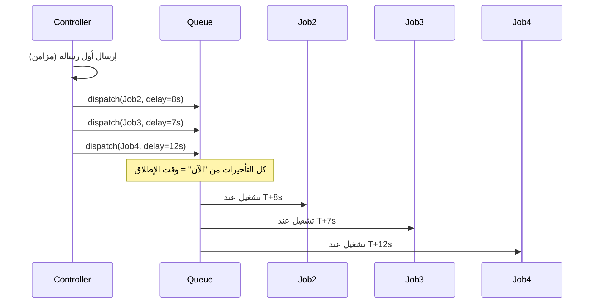

# إصلاح فواصل الوقت في الإرسال الجماعي لواتساب

## تشخيص المشكلة

الإعدادات (الفاصل بين الرسائل، الفاصل بين عمليات الإرسال الجماعي، التفاعيل العشوائي) **لا تُطبَّق** فعلياً لأن المنطق الحالي يجدول كل رسالة بتأخير **بالنسبة لوقت بدء الإرسال** وليس **بعد انتهاء الرسالة السابقة**.

### تدفق الكود الحالي

النتيجة: كل الوظائف تُنفَّذ خلال نافذة زمنية قصيرة (مثلاً 4–12 ثانية من بدء الإرسال) فتبدو وكأنها تُرسل "معاً".

### الملفات المعنية

- `app/Http/Controllers/Admin/WhatsAppMessageController.php` — دالة `broadcast()`: تحسب التأخير وتطلق الوظائف (حوالي السطور 396–411).
- `app/Jobs/BroadcastWhatsAppMessageJob.php` — المُنشئ: يستدعي `$this->delay($this->delaySeconds)` لكل وظيفة (حوالي السطور 41–44).
- `app/Services/WhatsApp/WhatsAppSettingsService.php` — يوفّر `getDelaySettings()` و `calculateDelay()` ويُستخدم بالفعل من الـ Controller.

### ملاحظة عن الإعدادات

- **الفاصل بين الرسائل** (`delay_between_messages`): يُستخدم في `calculateDelay()` ويُمرَّر للوظائف، لكن بدون تراكم التأخير لا يتحقق "فاصل بين كل رسالة والتي تليها".
- **الفاصل بين عمليات الإرسال الجماعي** (`delay_between_broadcasts`): مُخزَّن ويعرضه واجهة الإعدادات لكن **لا يُستخدم** في أي مكان في كود الإرسال الجماعي. يمكن تركه للمستقبل (مثلاً: تأخير قبل بدء أول رسالة في الطابور) أو توثيقه.

---

## الحل المقترح

جعل التأخير **تراكمياً** بحيث تُجدول الرسالة التالية بعد انتهاء الفاصل المطلوب من **بداية** الإرسال (أي: الرسالة 2 عند 0+delay1، الرسالة 3 عند 0+delay1+delay2، ...).

### 1. تعديل الـ Controller

في `app/Http/Controllers/Admin/WhatsAppMessageController.php` داخل `broadcast()`، عند حلقة `foreach ($students->slice(1) as $student)`:

- تعريف متغير تراكمي قبل الحلقة، مثلاً: `$cumulativeDelay = 0`.
- في كل تكرار:
  - حساب الفاصل للرسالة الحالية: `$delay = $this->settingsService->calculateDelay($baseDelay)` (كما هو الآن).
  - تحديث التراكم: `$cumulativeDelay += $delay`.
  - استدعاء `BroadcastWhatsAppMessageJob::dispatch(..., $cumulativeDelay, $index)` بدلاً من تمرير `$delay` فقط.

بهذا الشكل، الوظيفة الأولى في الطابور تُنفَّذ بعد `delay1` ثانية، والثانية بعد `delay1+delay2`، وهكذا، فيتطابق السلوك مع "الفاصل بين الرسائل" و"الفواصل العشوائية".

### 2. تعديل الـ Job (توضيح المعنى فقط)

في `app/Jobs/BroadcastWhatsAppMessageJob.php`:

- المعامل `$delaySeconds` سيعبّر من الآن فصاعداً عن **الوقت الكلي من الآن حتى موعد تنفيذ هذه الوظيفة** (التراكم).
- الإبقاء على: إذا `delaySeconds > 0` استدعاء `$this->delay($this->delaySeconds)`.
- إزالة أو تعديل الشرط الحالي الذي يربط التأخير بـ `messageIndex > 0` بحيث لا يُعاد حساب التأخير داخل الـ Job؛ المصدر الوحيد للتأخير يكون القيمة المُمرَّرة من الـ Controller (التراكم). يمكن جعل المنطق: "إذا `delaySeconds !== null && delaySeconds > 0` then `delay(delaySeconds)`" وتجاهل `messageIndex` في حساب التأخير.

لا حاجة لتغيير منطق الإرسال أو الـ retry داخل `handle()`.

### 3. (اختياري) الحد الأقصى للرسائل في الدقيقة

الإعداد `max_messages_per_minute` موجود في `WhatsAppSettingsService` لكن **لا يُطبَّق** في الإرسال الجماعي. إذا أردتم تفعيله لاحقاً، يمكن:

- عند حساب `$cumulativeDelay` أو عند جدولة الوظائف، التأكد من أن عدد الرسائل في أي نافذة 60 ثانية لا يتجاوز هذا الحد (مثلاً بزيادة التأخير التراكمي عندما يكون المعدل سيتجاوز الحد). هذا يمكن تركه كخطوة لاحقة بعد إصلاح التراكم.

---

## ملخص التغييرات

| الملف                             | التغيير                                                                                                                                                      |
| --------------------------------- | ------------------------------------------------------------------------------------------------------------------------------------------------------------ |
| `WhatsAppMessageController.php`   | استخدام تأخير تراكمي (`$cumulativeDelay += $delay`) وتمرير `$cumulativeDelay` إلى `BroadcastWhatsAppMessageJob::dispatch()`.                                 |
| `BroadcastWhatsAppMessageJob.php` | اعتبار `delaySeconds` دائماً كتأخير مطلق (ثوانٍ من الآن) وتطبيق `delay(delaySeconds)` عندما القيمة > 0، دون الاعتماد على `messageIndex` لإعادة حساب التأخير. |

بعد التعديل، يجب أن يعمل **الفاصل بين الرسائل** و**الفواصل العشوائية** (الحد الأدنى/الأقصى) كما يتوقعه المستخدم أثناء الإرسال الجماعي. التأكد من أن الـ queue يعمل بـ driver يدعم التأخير (مثل `database` أو `redis`) وليس `sync` حتى تُطبَّق التأخيرات فعلياً.
